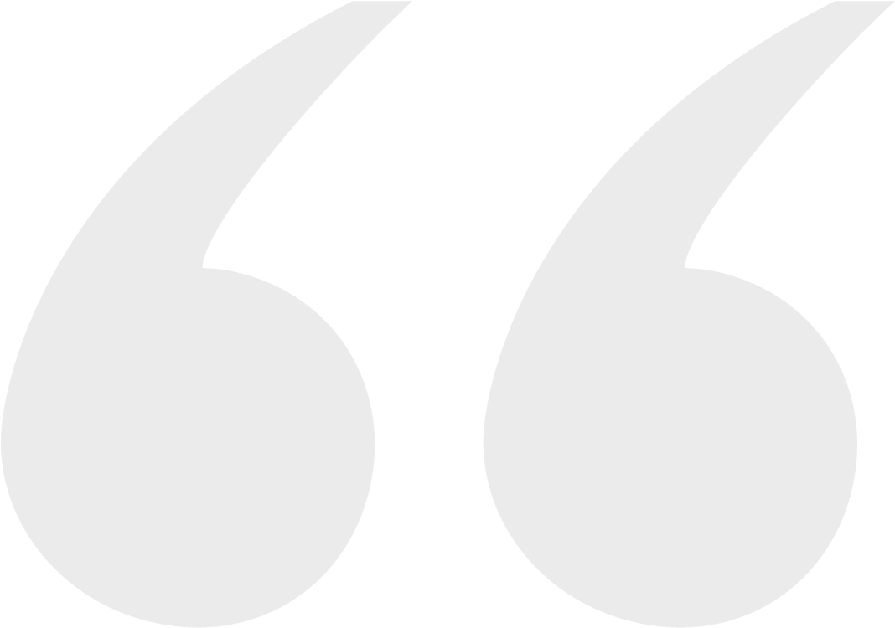
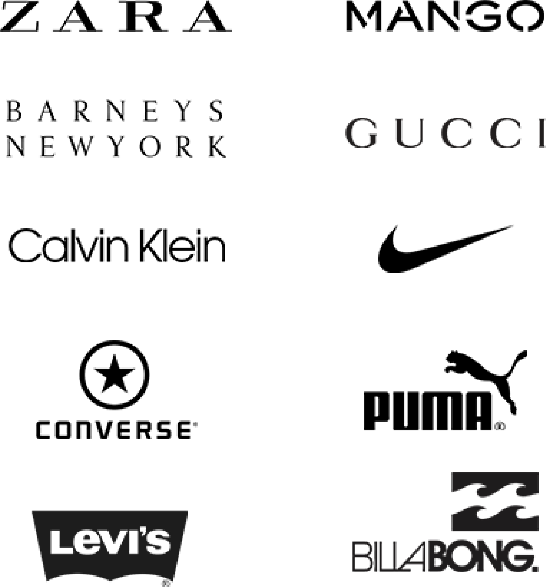

<!DOCTYPE html>
<html>

<head>
    <link href="./0 424 .css" type="text/css" rel="stylesheet">
    <link href="./425 768 .css" type="text/css" rel="stylesheet">
    <link href="./768 2464px c.css" type="text/css" rel="stylesheet">
    <meta name="viewport" content="width=device-width, initial-scale=1.0">
    <title>sohrabi-tajam</title>
    <link rel="icon" type="image/png" href="./image/logo-project-.png">
</head>

<body>
    <main>
        <!--Start start-->
        

            <section class="s1">
                <header>
                    <ul id="top-menu"><b>
                            <li><a href="#">CONTACT</a></li>
                            <li><a href="#">PEOPLE SAY</a></li>
                            <li><a href="#">WORKS</a></li>
                            <li><a href="#">TEAMS</a></li>
                            <li><a href="#">EXPERTICE</a></li>
                            <li><a href="#">ABOUT</a></li>
                            <li><a href="#">HOME</a></li>
                        </b></ul>
                    
                </header>
                

                    <h1 id="titr"><b>We Are Awesome Creative Agency</b></h1>
                    

                    <h3 id="matn-titr">Lorem Ipsum is simply dummy text of the printing and typesetting industry.  
                        Lorem Ipsum has been the industry's standard dummy text ever since the 1500s, 
                        when an unknown printer took a galley of type and scrambled it to make a type specimen book.
                    </h3>
                    <a href="#" class="more">
                        
LEARN MORE

                    </a>
                

            </section>
        

        <!--End start-->

        <!--Start our story-->
        <section class="s2">
            

                

                    <h2 class="h2">OUR STORY</h2>
                    
Lorem Ipsum is simply dummy text of the printing and typesetting
                        industry.Lorem
                        Ipsum
                        has been the industry's standard dummy text ever since the 1500s, when an unknown printer
                        took a
                        galley of type and scrambled it to make a type specimen book.It has survived not only five
                        centuries,
                        but also the leap into electronic typesetting,remaining essentially unchanged.

                    <a href="#" class="btns">LEARN MORE</a>
                

                

                    
                

            

        </section>
        <!--End our story-->
        <!--Start imformation about programmer-->
        

            <section class="s3">
                
                

                    
Lorem Ipsum is simply dummy text of the printing and typesetting industry.  Lorem
                        Ipsum
                        has
                        beenthe industry's standard dummy text ever since the 1500s, when an unknown
                        printer took
                        a
                        galley of type and scrambled it to make a typespecimen book. 

                    

                        
<b>soheil sohrabi</b>

                        soheil.soh1300@gmail.com   telegram: soheil_3
                        

                            
                        

                    

                

            </section>
        

        <!--End imformation about programmer-->

        <!--Start brand-->
        <section class="s4">
            

                

                    <h3 id="our-hc">OUR HAPPY CLIENT</h3>
                    
                

                

                    <h3 id="give-us">GIVE US A GOOD NEWS</h3>
                    <form>
                        <input type="text" placeholder="Name">
                        <input type="email" placeholder="Email">
                        <input type="text" placeholder="Subject">
                        <textarea placeholder="Your Message"></textarea>
                        <button class="btns" type="submit">SUBMIT</button>
                    </form>
                

            

        </section>
        <!--End brand-->

        <!--Start end-->
        

            <section class="s5">
                

                    <!--left-->
                    

                        

                            
                            

                                
 <small>Ipsum is simply dummy text of the printing and typesetting industry.
                                        Lorem Ipsum has been the industry's standard dummy text ever since the
                                        1500s</small>
                                

                                

                                    <ul>
                                        <li>HELP</li>
                                        <li>TERMS&CONDITION</li>
                                        <li>PRIVACY</li>
                                    </ul>
                                

                            

                        

                    

                    <!--center-->
                    

                        <h3 class="h3-end"><b>OUR STODIO</b></h3>
                        

                            
                            

                                <small>Ruko cucruk, ji. Radio luar dalem jos 
                                    No.12 - 13, Kalideres - Jakarta Barat 
                                    11480 - indonesia
                                </small>
                            

                        

                        

                            
                            

                                
(+62) 21-2224 3333

                            

                        

                    

                    <!--right-->
                    

                        

                            <h3 class="h3-end"><b>STAY IN TOUCH</b></h3>
                            

                                <form id="form-stay" action="#">
                                    <input id="email-box" type="email" placeholder="Subscribe our newsletter">
                                    <button type="submit"></button>
                                </form>
                                

                                    

                                        
                                        

                                            
                                        

                                    

                                

                            

                        

                    

                

            </section>
        

        <!--End end-->
    </main>
</body>

</html>
